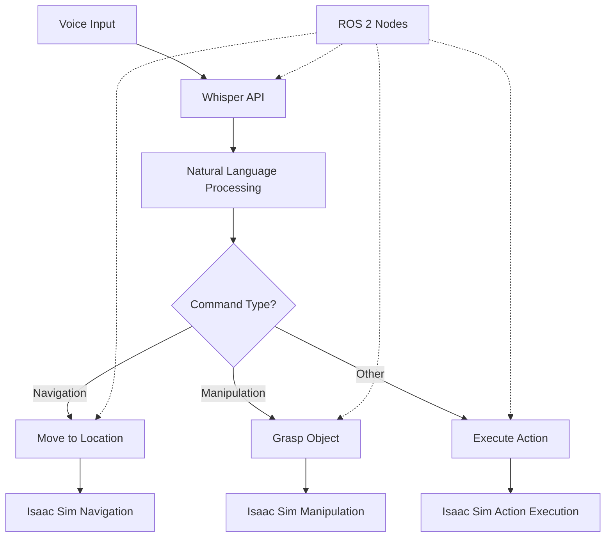

# Chapter 1: Voice/Speech Integration

## Learning Objectives

By the end of this chapter, you will be able to:

1. Set up and configure speech recognition systems for robotic applications
2. Process voice commands using OpenAI's Whisper API
3. Map natural language commands to ROS 2 actions
4. Implement voice-to-navigation and voice-to-manipulation systems
5. Integrate voice commands with Isaac Sim simulation environment

## Introduction

Voice/Speech integration is a critical component of natural human-robot interaction. In this chapter, we'll explore how to build systems that can understand voice commands and translate them into robotic actions. We'll focus on creating a robust pipeline that can process spoken instructions and execute them on humanoid robots in simulation.

## 1. Whisper API Setup and Configuration

### 1.1 Introduction to Speech Recognition in Robotics

Speech recognition enables natural interaction with robots by allowing users to communicate using natural language. In robotics applications, this typically involves:

- Converting spoken language to text
- Processing the text to understand the user's intent
- Mapping the intent to specific robotic actions
- Executing the actions in the robot's environment

### 1.2 Setting up OpenAI Whisper API

To get started with speech recognition, we'll use OpenAI's Whisper API, which provides state-of-the-art speech-to-text capabilities:

```python
import openai
import speech_recognition as sr
import pyaudio
import rospy
from std_msgs.msg import String

# Configure OpenAI API key
openai.api_key = os.getenv("OPENAI_API_KEY")

# Initialize speech recognition
recognizer = sr.Recognizer()
microphone = sr.Microphone()
```

### 1.3 Voice Command Processing Pipeline

The basic pipeline for voice command processing involves:

1. Audio capture from microphone
2. Preprocessing and noise reduction
3. Speech-to-text conversion
4. Natural language understanding
5. Command mapping to robotic actions

## 2. Speech Recognition Code Example

Let's implement a basic voice recognition system:

```python
import speech_recognition as sr
import rospy
from std_msgs.msg import String
import json

class VoiceCommandProcessor:
    def __init__(self):
        self.recognizer = sr.Recognizer()
        self.microphone = sr.Microphone()

        # Calibrate for ambient noise
        with self.microphone as source:
            self.recognizer.adjust_for_ambient_noise(source)

        # Initialize ROS publisher
        self.command_pub = rospy.Publisher('/voice_command', String, queue_size=10)

    def listen_for_command(self):
        """Listen for a voice command and return the text"""
        with self.microphone as source:
            print("Listening for command...")
            audio = self.recognizer.listen(source)

        try:
            # Use Whisper API for speech recognition
            text = self.recognizer.recognize_whisper_api(
                audio,
                api_key=os.getenv("OPENAI_API_KEY"),
                model="whisper-1"
            )
            return text
        except sr.RequestError as e:
            print(f"API error: {e}")
            return None
        except sr.UnknownValueError:
            print("Could not understand audio")
            return None
```

## 3. ROS Action Mapping

### 3.1 Mapping Voice Commands to ROS Actions

Once we have the transcribed text, we need to map it to specific ROS actions:

```python
def map_command_to_action(text):
    """Map voice command text to ROS action"""
    command = text.lower().strip()

    # Navigation commands
    if "move to" in command or "go to" in command:
        return parse_navigation_command(command)

    # Manipulation commands
    elif "pick up" in command or "grasp" in command:
        return parse_manipulation_command(command)

    # Other commands
    elif "stop" in command:
        return {"action": "stop", "params": {}}

    else:
        return {"action": "unknown", "params": {"text": command}}

def parse_navigation_command(text):
    """Parse navigation commands like 'move to the kitchen'"""
    # Extract destination from command
    if "kitchen" in text:
        return {"action": "navigate", "params": {"location": "kitchen"}}
    elif "living room" in text:
        return {"action": "navigate", "params": {"location": "living_room"}}
    elif "bedroom" in text:
        return {"action": "navigate", "params": {"location": "bedroom"}}
    else:
        # Try to extract general location
        words = text.split()
        location = words[-1] if len(words) > 0 else "unknown"
        return {"action": "navigate", "params": {"location": location}}
```

## 4. Voice-to-Navigation Example

Let's implement a complete example of voice-to-navigation:

```python
#!/usr/bin/env python3
import rospy
import actionlib
from move_base_msgs.msg import MoveBaseAction, MoveBaseGoal
from std_msgs.msg import String

class VoiceNavigationController:
    def __init__(self):
        rospy.init_node('voice_navigation_controller')

        # Setup move_base action client
        self.move_base_client = actionlib.SimpleActionClient('move_base', MoveBaseAction)
        self.move_base_client.wait_for_server()

        # Setup voice command subscriber
        self.voice_sub = rospy.Subscriber('/voice_command', String, self.voice_callback)

        # Location map for navigation goals
        self.location_goals = {
            'kitchen': self.create_goal(1.0, 2.0, 0.0, 1.0),  # quaternion (w=1 for no rotation)
            'living_room': self.create_goal(-1.0, 1.0, 0.0, 1.0),
            'bedroom': self.create_goal(0.0, -2.0, 0.0, 1.0),
        }

    def create_goal(self, x, y, z, w):
        """Create a navigation goal with given coordinates"""
        goal = MoveBaseGoal()
        goal.target_pose.header.frame_id = "map"
        goal.target_pose.header.stamp = rospy.Time.now()
        goal.target_pose.pose.position.x = x
        goal.target_pose.pose.position.y = y
        goal.target_pose.pose.orientation.z = z
        goal.target_pose.pose.orientation.w = w
        return goal

    def voice_callback(self, msg):
        """Process voice command and execute navigation"""
        command_data = json.loads(msg.data)

        if command_data['action'] == 'navigate':
            location = command_data['params']['location']
            if location in self.location_goals:
                goal = self.location_goals[location]
                self.move_base_client.send_goal(goal)
                rospy.loginfo(f"Moving to {location}")
            else:
                rospy.logwarn(f"Unknown location: {location}")

    def run(self):
        """Run the controller"""
        rospy.spin()

if __name__ == '__main__':
    controller = VoiceNavigationController()
    controller.run()
```

## 5. Voice-to-Manipulation Example

For manipulation tasks, we'll create a similar system:

```python
#!/usr/bin/env python3
import rospy
from std_msgs.msg import String
import json

class VoiceManipulationController:
    def __init__(self):
        rospy.init_node('voice_manipulation_controller')

        # Setup manipulation command publisher
        self.manipulation_pub = rospy.Publisher('/manipulation_command', String, queue_size=10)

        # Setup voice command subscriber
        self.voice_sub = rospy.Subscriber('/voice_command', String, self.voice_callback)

    def voice_callback(self, msg):
        """Process voice command and execute manipulation"""
        command_data = json.loads(msg.data)

        if command_data['action'] == 'grasp':
            object_name = command_data['params']['object']
            self.execute_grasp(object_name)

    def execute_grasp(self, object_name):
        """Execute grasp action for specified object"""
        # This would interface with your robot's manipulation system
        grasp_command = {
            "action": "grasp",
            "object": object_name,
            "pre_grasp_distance": 0.1,
            "grasp_width": 0.05
        }
        self.manipulation_pub.publish(json.dumps(grasp_command))
        rospy.loginfo(f"Attempting to grasp {object_name}")

    def run(self):
        """Run the controller"""
        rospy.spin()
```

## 6. Isaac Sim Integration

To integrate with Isaac Sim, we'll need to connect our ROS nodes to the simulation environment:

```python
# Isaac Sim ROS Bridge Integration
# This code would run in Isaac Sim's Python console or as part of an extension

import omni
import carb
import rospy
from geometry_msgs.msg import Twist
from sensor_msgs.msg import JointState

class IsaacSimRobotInterface:
    def __init__(self):
        # Initialize ROS node
        rospy.init_node('isaac_sim_robot_interface')

        # Subscribe to velocity commands
        self.vel_sub = rospy.Subscriber('/cmd_vel', Twist, self.velocity_callback)

        # Publish joint states
        self.joint_pub = rospy.Publisher('/joint_states', JointState, queue_size=10)

        # Reference to the robot in Isaac Sim
        self.robot = None
        self.get_robot_reference()

    def get_robot_reference(self):
        """Get reference to the robot in Isaac Sim"""
        # This would use Isaac Sim's USD path to find the robot
        self.robot = omni.usd.get_context().get_stage().GetPrimAtPath("/World/Robot")

    def velocity_callback(self, msg):
        """Apply velocity commands to the robot in simulation"""
        # Apply linear and angular velocities to the robot
        linear_vel = msg.linear.x
        angular_vel = msg.angular.z

        # Set the robot's velocity in Isaac Sim
        # This would use Isaac Sim's physics APIs
        pass

    def publish_joint_states(self):
        """Publish current joint states from Isaac Sim"""
        # Get current joint positions from Isaac Sim
        # Publish as JointState message
        pass
```

## 7. VLA Pipeline Diagram



## Summary

In this chapter, we've learned how to build a complete voice-to-action pipeline that can process spoken commands and execute them on a humanoid robot in simulation. We covered:

- Setting up speech recognition with OpenAI's Whisper API
- Processing voice commands and mapping them to ROS actions
- Implementing navigation and manipulation systems
- Integrating with Isaac Sim simulation environment

In the next chapter, we'll explore how to enhance this system with cognitive planning using large language models.