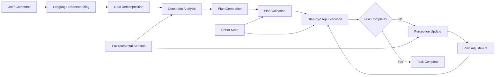

# Chapter 2: LLM Planning

## Learning Objectives

By the end of this chapter, you will be able to:

1. Implement cognitive planning systems using large language models
2. Create high-level task decomposition pipelines
3. Map complex user instructions to sequences of robotic actions
4. Integrate RT-2 and PaLM-E concepts for robotic planning
5. Test cognitive planning in simulation environments

## Introduction

Large Language Models (LLMs) have revolutionized how we approach cognitive planning in robotics. In this chapter, we'll explore how to leverage LLMs for high-level task decomposition and planning, creating systems that can interpret complex user instructions and break them down into executable robotic actions.

## 1. LLM-Based Task Decomposition

### 1.1 Understanding Cognitive Planning in Robotics

Cognitive planning involves translating high-level goals into sequences of low-level actions that robots can execute. Traditional approaches use predefined rules and finite state machines, but LLMs offer a more flexible and natural approach:

- Understanding complex, ambiguous instructions
- Breaking down tasks into manageable steps
- Adapting to new situations without explicit programming
- Handling multi-step instructions with dependencies

### 1.2 Setting up LLM Integration

We'll use OpenAI's GPT models for cognitive planning:

```python
import openai
import json
import rospy
from std_msgs.msg import String

class LLMPlanner:
    def __init__(self):
        openai.api_key = os.getenv("OPENAI_API_KEY")
        self.client = openai.OpenAI()

    def decompose_task(self, high_level_goal):
        """Decompose a high-level goal into executable steps"""
        prompt = f"""
        You are a cognitive planning system for a humanoid robot.
        Decompose the following high-level goal into a sequence of executable robotic actions.

        Goal: {high_level_goal}

        Return a JSON list of steps, each with an action type and parameters.

        Example format:
        [
            {{"action": "navigate", "params": {{"location": "kitchen"}}},
            {{"action": "detect_object", "params": {{"object_type": "mug"}}},
            {{"action": "grasp", "params": {{"object_id": "mug_123"}}},
            {{"action": "navigate", "params": {{"location": "table"}}},
            {{"action": "place", "params": {{"location": "table"}}}
        ]
        """

        response = self.client.chat.completions.create(
            model="gpt-4",
            messages=[{"role": "user", "content": prompt}],
            temperature=0.1
        )

        try:
            # Extract JSON from response
            content = response.choices[0].message.content
            steps = json.loads(content.strip())
            return steps
        except json.JSONDecodeError:
            # Handle case where response isn't valid JSON
            return self.parse_steps_from_text(content)
```

## 2. Cognitive Planning Algorithms

### 2.1 Hierarchical Task Networks (HTN)

LLMs can be used to create hierarchical task networks that organize actions into high-level and low-level tasks:

```python
class HierarchicalPlanner:
    def __init__(self):
        self.llm_planner = LLMPlanner()

    def create_plan(self, goal):
        """Create a hierarchical plan for the given goal"""
        # High-level plan from LLM
        high_level_steps = self.llm_planner.decompose_task(goal)

        # Expand each high-level step into detailed actions
        detailed_plan = []
        for step in high_level_steps:
            detailed_actions = self.expand_step(step)
            detailed_plan.extend(detailed_actions)

        return detailed_plan

    def expand_step(self, high_level_step):
        """Expand a high-level step into detailed robotic actions"""
        action_type = high_level_step['action']

        if action_type == 'navigate':
            return self.expand_navigation(high_level_step)
        elif action_type == 'grasp':
            return self.expand_grasp(high_level_step)
        elif action_type == 'place':
            return self.expand_place(high_level_step)
        else:
            # Default expansion for unknown action types
            return [high_level_step]
```

### 2.2 Constraint-Based Planning

LLMs can help identify and handle constraints in robotic tasks:

```python
def identify_constraints(self, task_description):
    """Identify constraints and requirements for a task"""
    prompt = f"""
    Identify all constraints, requirements, and potential obstacles for the following task:

    Task: {task_description}

    Return a JSON object with:
    - physical_constraints: Physical limitations
    - temporal_constraints: Time-related limitations
    - safety_constraints: Safety requirements
    - resource_constraints: Resource requirements
    - environmental_constraints: Environmental factors
    """

    response = self.client.chat.completions.create(
        model="gpt-4",
        messages=[{"role": "user", "content": prompt}],
        temperature=0.1
    )

    return json.loads(response.choices[0].message.content)
```

## 3. High-Level Command Processing

### 3.1 Processing Complex Instructions

LLMs excel at processing complex, multi-step instructions:

```python
class ComplexCommandProcessor:
    def __init__(self):
        self.planner = HierarchicalPlanner()

    def process_complex_command(self, command):
        """Process a complex command and return an executable plan"""
        # First, decompose the command into high-level goals
        high_level_goals = self.extract_goals(command)

        # Then create detailed plans for each goal
        all_plans = []
        for goal in high_level_goals:
            plan = self.planner.create_plan(goal)
            all_plans.append(plan)

        # Combine plans, handling dependencies between them
        combined_plan = self.combine_plans(all_plans)

        return combined_plan

    def extract_goals(self, command):
        """Extract high-level goals from a complex command"""
        prompt = f"""
        Extract the high-level goals from this complex command.
        A goal is a major objective that needs to be achieved.

        Command: {command}

        Return a JSON list of goals.
        """

        response = self.client.chat.completions.create(
            model="gpt-4",
            messages=[{"role": "user", "content": prompt}],
            temperature=0.1
        )

        return json.loads(response.choices[0].message.content)
```

## 4. Multi-Step Command Execution Workflow

### 4.1 Coordinating Complex Actions

```python
class PlanExecutor:
    def __init__(self):
        # Publishers for different robot capabilities
        self.nav_pub = rospy.Publisher('/navigation_goal', String, queue_size=10)
        self.manip_pub = rospy.Publisher('/manipulation_command', String, queue_size=10)
        self.perception_pub = rospy.Publisher('/perception_request', String, queue_size=10)

    def execute_plan(self, plan):
        """Execute a plan step by step"""
        for i, step in enumerate(plan):
            rospy.loginfo(f"Executing step {i+1}/{len(plan)}: {step['action']}")

            success = self.execute_step(step)
            if not success:
                rospy.logerr(f"Failed to execute step: {step}")
                return False

        rospy.loginfo("Plan completed successfully!")
        return True

    def execute_step(self, step):
        """Execute a single step in the plan"""
        action_type = step['action']

        if action_type == 'navigate':
            return self.execute_navigation(step['params'])
        elif action_type == 'grasp':
            return self.execute_grasp(step['params'])
        elif action_type == 'detect_object':
            return self.execute_perception(step['params'])
        elif action_type == 'place':
            return self.execute_placement(step['params'])
        else:
            rospy.logwarn(f"Unknown action type: {action_type}")
            return False
```

## 5. Action Sequence Planning with Mermaid Diagrams

Here's a diagram showing the flow of a cognitive planning system:

```mermaid
graph TD
    A[User Goal: "Clean the room"] --> B[LLM Task Decomposition]
    B --> C[High-level Plan Creation]
    C --> D[Constraint Analysis]
    D --> E[Plan Validation]
    E --> F{Plan Feasible?}
    F -->|Yes| G[Execute Navigation to Location 1]
    F -->|No| H[Revise Plan]
    H --> C
    G --> I[Detect Objects]
    I --> J[Grasp Object]
    J --> K[Place in Bin]
    K --> L{More Objects?}
    L -->|Yes| G
    L -->|No| M[Move to Next Location]
    M --> N{All Locations Done?}
    N -->|No| G
    N -->|Yes| O[Plan Complete]
```

## 6. RT-2 and PaLM-E Implementation Examples

### 6.1 RT-2 Integration Concepts

RT-2 (Robotics Transformer 2) combines vision, language, and action understanding:

```python
class RT2Planner:
    """Conceptual implementation of RT-2 planning principles"""

    def __init__(self):
        self.vision_processor = VisionProcessor()
        self.language_encoder = LanguageEncoder()
        self.action_decoder = ActionDecoder()

    def plan_with_vision_language(self, instruction, visual_input):
        """Plan using both language instruction and visual context"""
        # Encode the language instruction
        language_features = self.language_encoder.encode(instruction)

        # Process visual input
        visual_features = self.vision_processor.process(visual_input)

        # Combine features and generate action sequence
        action_sequence = self.action_decoder.generate(
            language_features, visual_features
        )

        return action_sequence
```

### 6.2 PaLM-E Concepts

PaLM-E (Pathways Language Model for Embodied) integrates large language models with embodied tasks:

```python
class PaLMEPlanner:
    """Conceptual implementation of PaLM-E planning principles"""

    def __init__(self):
        self.llm = LargeLanguageModel()
        self.embodied_context = EmbodiedContextProcessor()

    def plan_embodied_task(self, goal, current_state, environment_state):
        """Plan embodied tasks considering current context"""
        # Create embodied prompt with current state
        embodied_prompt = self.embodied_context.create_prompt(
            goal, current_state, environment_state
        )

        # Generate plan using LLM
        plan = self.llm.generate_plan(embodied_prompt)

        return plan
```

## 7. Cognitive Planning Flow Diagram



## Summary

In this chapter, we've explored how to implement cognitive planning systems using large language models. We covered:

- LLM-based task decomposition for complex robotic tasks
- Hierarchical planning approaches
- Constraint analysis and plan validation
- Multi-step command execution workflows
- Concepts from RT-2 and PaLM-E for embodied AI

In the next chapter, we'll integrate these planning capabilities with multi-modal perception to create complete Vision-Language-Action systems.