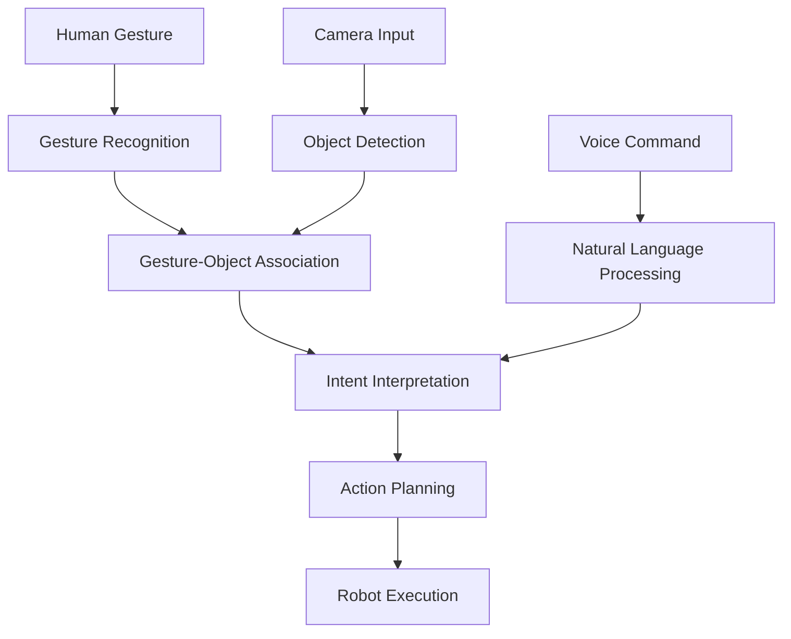
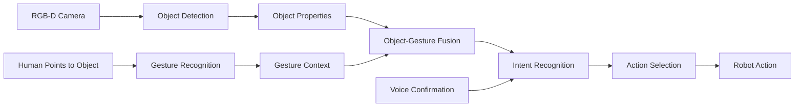
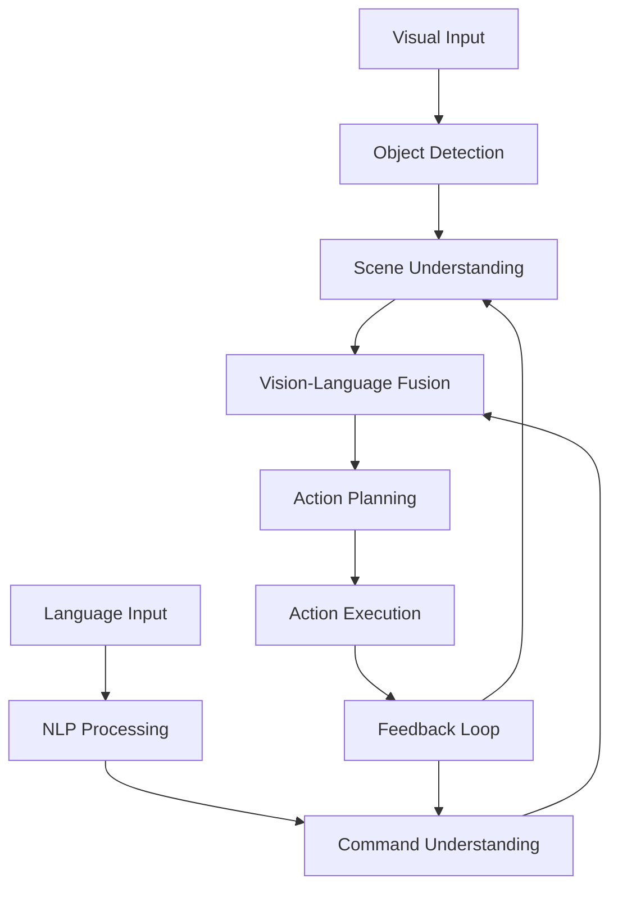

# Chapter 3: Multi-Modal Human-Robot Interaction

## Learning Objectives

By the end of this chapter, you will be able to:

1. Integrate vision-language systems for robotic applications
2. Implement object recognition with language understanding
3. Create visual command processing systems
4. Build gesture-vision fusion for natural interaction
5. Design complete Vision-Language-Action (VLA) pipelines

## Introduction

Multi-modal perception combines visual, auditory, and language inputs to enable natural human-robot interaction. In this chapter, we'll explore how to build systems that can process multiple sensory inputs simultaneously, creating more intuitive and capable robotic systems. This is the foundation of Vision-Language-Action (VLA) systems.

## 1. Vision-Language Integration

### 1.1 Understanding Multi-Modal Perception

Multi-modal perception in robotics involves processing and fusing information from multiple sensory modalities:

- **Visual**: Camera feeds, depth sensors, object detection
- **Language**: Speech commands, text instructions, natural language
- **Action**: Motor commands, tactile feedback, proprioception

The key challenge is creating systems that can effectively combine these modalities to understand and respond to complex human instructions.

### 1.2 Setting up Vision-Language Models

We'll use OpenAI's GPT-4 Vision capabilities for processing visual and language inputs together:

```python
import openai
import cv2
import numpy as np
import rospy
from sensor_msgs.msg import Image
from cv_bridge import CvBridge
import json
import base64

class VisionLanguageProcessor:
    def __init__(self):
        openai.api_key = os.getenv("OPENAI_API_KEY")
        self.client = openai.OpenAI()
        self.bridge = CvBridge()

    def process_visual_command(self, image, command):
        """Process a visual scene with a language command"""
        # Convert ROS image to base64 for API
        cv_image = self.bridge.imgmsg_to_cv2(image, "bgr8")
        _, buffer = cv2.imencode('.jpg', cv_image)
        image_base64 = base64.b64encode(buffer).decode('utf-8')

        prompt = f"""
        You are a vision-language assistant for a humanoid robot.
        Analyze the image and interpret the command: {command}

        Describe what you see in the image and how to execute the command.
        Return a JSON object with:
        - detected_objects: List of objects detected in the image
        - action: Action to take based on the command
        - parameters: Parameters for the action (locations, objects, etc.)
        """

        response = self.client.chat.completions.create(
            model="gpt-4-vision-preview",
            messages=[
                {
                    "role": "user",
                    "content": [
                        {"type": "text", "text": prompt},
                        {
                            "type": "image_url",
                            "image_url": {
                                "url": f"data:image/jpeg;base64,{image_base64}"
                            }
                        }
                    ]
                }
            ],
            max_tokens=500
        )

        return json.loads(response.choices[0].message.content)
```

## 2. Object Recognition with Language Understanding

### 2.1 Visual Question Answering

```python
class VisualQuestionAnswering:
    def __init__(self):
        self.vision_processor = VisionLanguageProcessor()

    def answer_visual_question(self, image, question):
        """Answer a question about the visual scene"""
        prompt = f"""
        Answer the following question about the image:
        {question}

        Provide a concise answer based on what you can see in the image.
        """

        # Similar implementation to process_visual_command but focused on Q&A
        cv_image = self.bridge.imgmsg_to_cv2(image, "bgr8")
        _, buffer = cv2.imencode('.jpg', cv_image)
        image_base64 = base64.b64encode(buffer).decode('utf-8')

        response = self.client.chat.completions.create(
            model="gpt-4-vision-preview",
            messages=[
                {
                    "role": "user",
                    "content": [
                        {"type": "text", "text": prompt},
                        {
                            "type": "image_url",
                            "image_url": {
                                "url": f"data:image/jpeg;base64,{image_base64}"
                            }
                        }
                    ]
                }
            ],
            max_tokens=200
        )

        return response.choices[0].message.content
```

### 2.2 Object Detection and Language Mapping

```python
def detect_and_describe_objects(self, image):
    """Detect objects in the image and provide natural language descriptions"""
    prompt = """
    Identify and describe all objects in the image.
    For each object, provide:
    - Object name/type
    - Color
    - Size (relative to other objects)
    - Position in the image (left, right, center, etc.)
    - Material (if visible)

    Return as a JSON list of objects with these properties.
    """

    cv_image = self.bridge.imgmsg_to_cv2(image, "bgr8")
    _, buffer = cv2.imencode('.jpg', cv_image)
    image_base64 = base64.b64encode(buffer).decode('utf-8')

    response = self.client.chat.completions.create(
        model="gpt-4-vision-preview",
        messages=[
            {
                "role": "user",
                "content": [
                    {"type": "text", "text": prompt},
                    {
                        "type": "image_url",
                        "image_url": {
                            "url": f"data:image/jpeg;base64,{image_base64}"
                        }
                    }
                ]
            }
        ],
        max_tokens=500
    )

    return json.loads(response.choices[0].message.content)
```

## 3. Visual Command Processing Example

### 3.1 Processing Spatial Commands

```python
class SpatialCommandProcessor:
    def __init__(self):
        self.vision_processor = VisionLanguageProcessor()

    def process_spatial_command(self, image, command):
        """Process commands that involve spatial relationships"""
        # Example: "Pick up the red object to the left of the blue cup"
        prompt = f"""
        You are a spatial reasoning assistant for a humanoid robot.
        Analyze the image to understand the spatial relationships in this command:
        {command}

        Identify the target object based on the spatial description.
        Return a JSON object with:
        - target_object: Description of the object to interact with
        - spatial_relationships: Relationships described in the command
        - action: Action to take (grasp, point, etc.)
        - coordinates: Approximate coordinates of the target object in the image
        """

        cv_image = self.bridge.imgmsg_to_cv2(image, "bgr8")
        _, buffer = cv2.imencode('.jpg', cv_image)
        image_base64 = base64.b64encode(buffer).decode('utf-8')

        response = self.client.chat.completions.create(
            model="gpt-4-vision-preview",
            messages=[
                {
                    "role": "user",
                    "content": [
                        {"type": "text", "text": prompt},
                        {
                            "type": "image_url",
                            "image_url": {
                                "url": f"data:image/jpeg;base64,{image_base64}"
                            }
                        }
                    ]
                }
            ],
            max_tokens=500
        )

        return json.loads(response.choices[0].message.content)
```

## 4. Gesture-Vision Fusion Diagram



## 5. Multi-Modal Interaction Workflows

### 5.1 Coordinating Multiple Inputs

```python
class MultiModalCoordinator:
    def __init__(self):
        self.vision_processor = VisionLanguageProcessor()
        self.speech_processor = VoiceCommandProcessor()  # From Chapter 1
        self.llm_planner = LLMPlanner()  # From Chapter 2

    def coordinate_interaction(self, image, voice_command):
        """Coordinate vision and voice inputs to generate action"""
        # Process visual scene
        vision_result = self.vision_processor.process_visual_command(
            image, voice_command
        )

        # Process voice command
        voice_result = self.speech_processor.process_command(voice_command)

        # Combine results and generate plan
        combined_input = {
            'visual_analysis': vision_result,
            'voice_analysis': voice_result,
            'command': voice_command
        }

        # Generate execution plan
        plan = self.llm_planner.generate_multimodal_plan(combined_input)

        return plan
```

## 6. Vision-Language-Action Pipeline Examples

### 6.1 Complete VLA Implementation

```python
#!/usr/bin/env python3
import rospy
from sensor_msgs.msg import Image, CameraInfo
from std_msgs.msg import String
import threading
import json

class VLAPipeline:
    def __init__(self):
        rospy.init_node('vla_pipeline')

        # Initialize processors
        self.coordinator = MultiModalCoordinator()

        # Publishers and subscribers
        self.image_sub = rospy.Subscriber('/camera/rgb/image_raw', Image, self.image_callback)
        self.voice_sub = rospy.Subscriber('/voice_command', String, self.voice_callback)
        self.action_pub = rospy.Publisher('/robot_action', String, queue_size=10)

        # Store latest image for processing with voice commands
        self.latest_image = None
        self.image_lock = threading.Lock()

        # Store pending voice commands
        self.pending_commands = []

    def image_callback(self, msg):
        """Store latest image for multimodal processing"""
        with self.image_lock:
            self.latest_image = msg

    def voice_callback(self, msg):
        """Process voice command with latest image"""
        command = msg.data

        # Get latest image
        with self.image_lock:
            if self.latest_image is None:
                rospy.logwarn("No image available for multimodal processing")
                return

            latest_image = self.latest_image

        # Process with multimodal coordinator
        try:
            plan = self.coordinator.coordinate_interaction(latest_image, command)

            # Execute the plan
            action_msg = String()
            action_msg.data = json.dumps(plan)
            self.action_pub.publish(action_msg)

            rospy.loginfo(f"VLA pipeline executed plan for command: {command}")
        except Exception as e:
            rospy.logerr(f"Error in VLA pipeline: {e}")
```

## 7. Gesture-Vision Fusion Diagrams



## 8. Vision-Language-Action Pipeline



## Summary

In this chapter, we've explored how to build multi-modal perception systems that combine vision, language, and action for natural human-robot interaction. We covered:

- Vision-language integration using GPT-4 Vision
- Object recognition with language understanding
- Visual command processing for spatial relationships
- Gesture-vision fusion for natural interaction
- Complete Vision-Language-Action (VLA) pipeline implementation

This completes the core Vision-Language-Action module. You now have a comprehensive understanding of how to build systems that can process voice commands, perform cognitive planning, and integrate multi-modal perception for natural human-robot interaction.