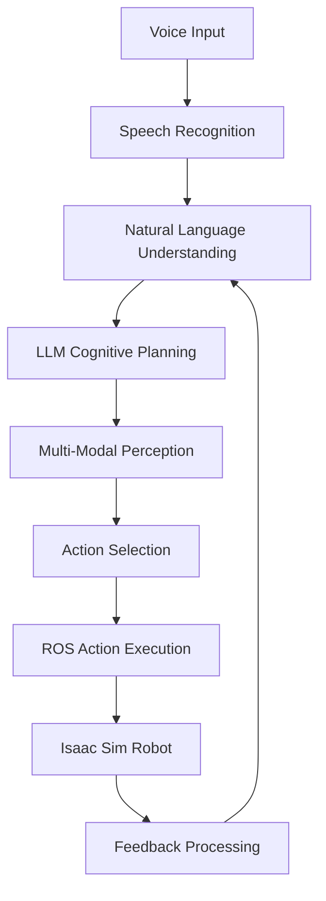

# Capstone Project: Complete Vision-Language-Action Pipeline

## Project Overview

In this capstone project, you will implement a complete Vision-Language-Action (VLA) pipeline that integrates all components learned in Module 4. The system will accept voice commands, perform cognitive planning using LLMs, perceive the environment visually, and execute complex robotic actions in simulation.

## Learning Objectives

By completing this capstone project, you will demonstrate the ability to:

1. Integrate voice recognition, cognitive planning, and multi-modal perception
2. Create a complete "voice → plan → walk → grasp" pipeline
3. Implement error handling and recovery in complex robotic systems
4. Test and validate VLA systems in Isaac Sim simulation environment
5. Document and present your VLA system implementation

## Project Requirements

### Core Functionality
- Voice command processing using OpenAI Whisper API
- Cognitive planning with LLMs for task decomposition
- Multi-modal perception combining vision and language
- Navigation and manipulation execution in simulation
- Confidence-based decision making and error recovery

### Technical Requirements
- ROS 2 Humble integration
- Isaac Sim or Gazebo simulation environment
- OpenAI API integration (for Whisper and GPT models)
- Real-time processing capabilities
- Proper error handling and logging

### Performance Requirements
- Voice recognition accuracy &gt;85% in quiet environment
- Object identification accuracy &gt;80% in good lighting
- Planning time &lt;5 seconds for simple tasks
- Execution success rate &gt;70% for simple grasp tasks

## Project Structure

### Phase 1: System Architecture (Week 1)
- Design the complete VLA system architecture
- Identify interfaces between components
- Plan ROS node structure and message types
- Set up development environment

### Phase 2: Component Implementation (Week 2)
- Implement voice recognition component
- Create cognitive planning system
- Build multi-modal perception module
- Set up simulation environment

### Phase 3: Integration and Testing (Week 3)
- Integrate all components into a cohesive system
- Test individual components and their interactions
- Debug and optimize system performance
- Implement error handling and recovery

### Phase 4: Validation and Presentation (Week 4)
- Validate the complete system with various commands
- Document the implementation and lessons learned
- Create demonstration video
- Present the system to peers

## Implementation Steps

### Step 1: System Architecture Design

### Step 2: Core Component Development
1. **Voice Recognition Module**
   - Integrate Whisper API for speech-to-text
   - Implement voice activity detection
   - Create command parsing for robot actions

2. **Cognitive Planning Module**
   - Use GPT-4 for task decomposition
   - Implement hierarchical planning
   - Add constraint checking and validation

3. **Multi-Modal Perception Module**
   - Integrate GPT-4 Vision for object recognition
   - Implement spatial relationship understanding
   - Create confidence-based object selection

4. **Action Execution Module**
   - Implement ROS 2 action clients for navigation
   - Create manipulation action interfaces
   - Add safety checks and validation

### Step 3: Integration Strategy
- Use ROS topics and services for inter-component communication
- Implement state management for complex multi-step tasks
- Add logging and debugging capabilities
- Create configuration files for different scenarios

### Step 4: Testing Plan
- Unit tests for individual components
- Integration tests for component interactions
- System tests with complete voice commands
- Performance tests under various conditions

## Example Use Cases

### Use Case 1: Room Cleaning
- Voice Command: "Please clean up the living room"
- System Response:
  1. Plan: Identify objects to be moved, determine destinations
  2. Perceive: Locate objects in the room
  3. Execute: Navigate to objects, grasp and place in appropriate locations

### Use Case 2: Object Retrieval
- Voice Command: "Bring me the red water bottle from the kitchen"
- System Response:
  1. Plan: Navigate to kitchen, identify red bottle, grasp it, return
  2. Perceive: Confirm object identity and location
  3. Execute: Complete the retrieval task

### Use Case 3: Setting the Table
- Voice Command: "Set the table for dinner with plates and cups"
- System Response:
  1. Plan: Determine table location, identify required objects, placement positions
  2. Perceive: Locate plates and cups, identify table surface
  3. Execute: Transport and place objects appropriately

## Evaluation Criteria

### Technical Implementation (50%)
- Correctness of voice recognition and processing
- Effectiveness of cognitive planning
- Accuracy of multi-modal perception
- Reliability of action execution

### System Integration (30%)
- Smooth interaction between components
- Proper error handling and recovery
- Real-time performance characteristics
- Robustness to environmental variations

### Documentation and Presentation (20%)
- Clear architecture documentation
- Comprehensive testing results
- Effective demonstration of capabilities
- Lessons learned and future improvements

## Resources and References

- OpenAI API documentation for Whisper and GPT models
- ROS 2 Humble documentation
- Isaac Sim integration guides
- Previous module materials (Chapters 1-3)

## Submission Requirements

1. Complete source code with documentation
2. System architecture diagram and design document
3. Test results and performance metrics
4. Demonstration video (5-10 minutes)
5. Final project report (1000-1500 words)

## Timeline

- Week 1: Architecture design and environment setup
- Week 2: Core component implementation
- Week 3: Integration and testing
- Week 4: Validation, documentation, and presentation

## Success Metrics

- Demonstrate successful completion of at least 3 different use cases
- Achieve &gt;70% success rate on simple tasks
- Present a working system with clear documentation
- Show understanding of VLA system challenges and solutions